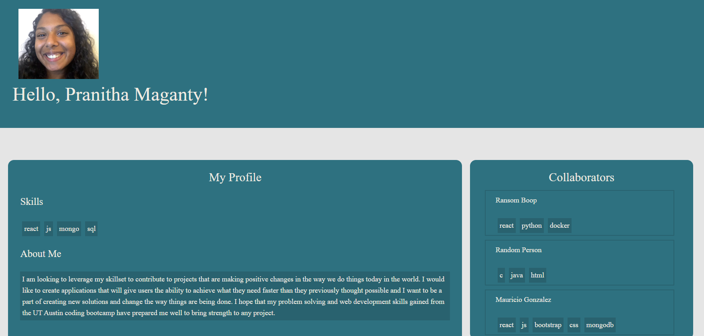
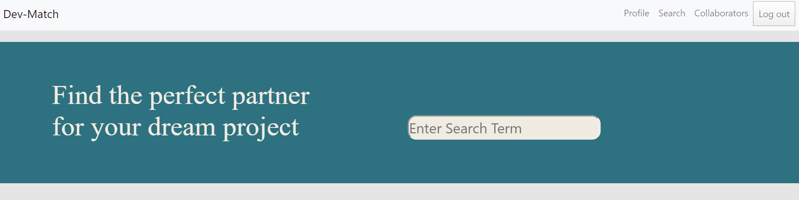
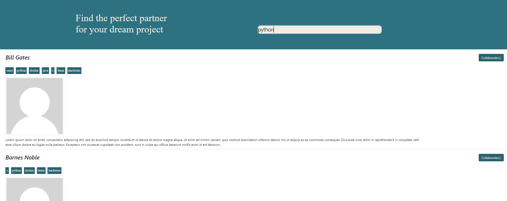
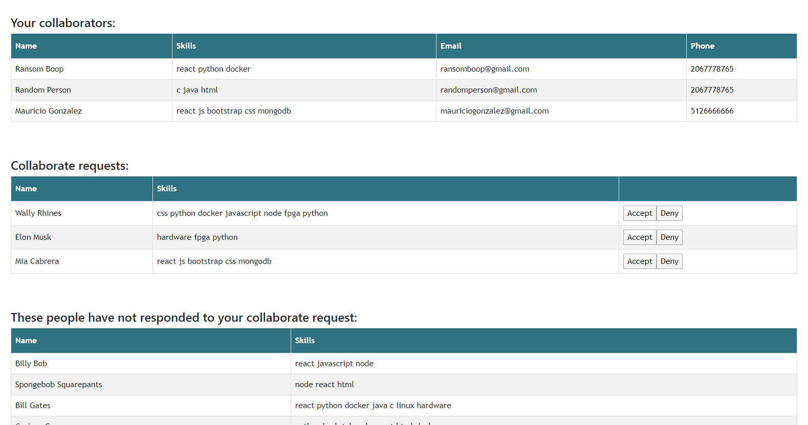

# DevMatch

## Description

DevMatch is a great app for inspiring and experienced developers to connect and collaborate with the best talent in the world of coding and web development! This web app allows the user to find a suitable collaborator by searching a specific skill. The user will submit a request to any and all potential collaborators that are returned in the results page. If the second collaborator accepts the request, they then connect and can work on a dream project!

## App Preview

### Landing Page:


### Profile Page:


### Searching:



### Collaborators Page:


## Deployed App

Go to [DevMatch](http://afternoon-springs-32629.herokuapp.com/)!

        
## Table of Contents
        
* [Installation](#installation)
        
* [Technologies Used](#technologies)

* [Authors](#authors)
        
* [Questions](#questions)

* [License](#license)
   
        
## Installation
        
### Dependencies

To install necessary dependencies, run the following command:
        
```
npm i
```
### Auth0

To view `Auth0` installation and how to create and configure your own app visit their documentation site [here](https://auth0.com/docs/quickstart/spa/react/01-login#configure-auth0).


## Technologies

* React
* Auth0 (For authentication)
* Bootstrap
* MongoDB
* Mongoose
* Heroku (For deployment)
* Multer

## Authors

* Mauricio Gonzalez
* Pranitha Maganty
* Ashwin Bethala
* Mia L. Cabrera
* Aroldo Reyes

        
## Questions
        
If you are having issues, need support or have any questions about the repo, please let us know.
Contact us directly through this repository.

## License

[](https://opensource.org/licenses/MIT)
        